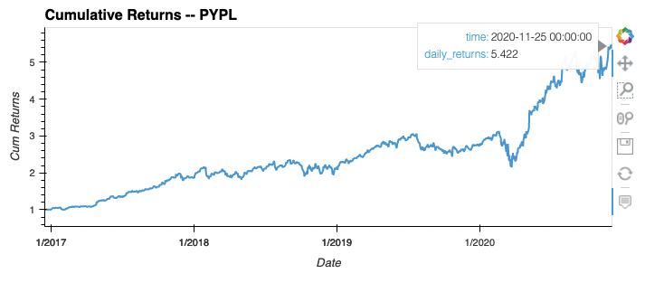
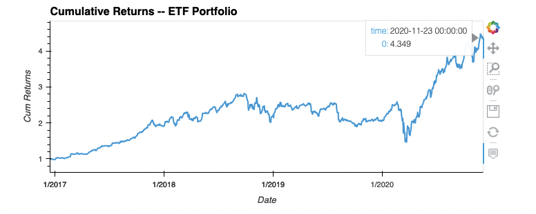
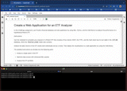

# ETF Analysis Web Application
ETF Analysis Web App -- Fintech Challenge 7

---

## Analysis 

This is an analysis of an Exchange Traded Fund, which is a basket of four stock funds. First a single fund, `PYPL` is analyzed, followed by analysis of the entire set of four funds.

See full analysis details in the notebook [etf_analyzer.ipynb](app/etf_analyzer.ipynb)  


#### DataSets  

A SQL database file [etf.db](data/etf.db) provides all the price data for analysis.  
    - pricing data from `2016-12-16` to `2020-12-04`
    - each stock table contains data: `time | open | high | low | close | volume | daily_returns`
    - stocks `GDOT, GS, PYPL, SQ`

#### Assumptions
- The time period analyzed will be from Dec 2016 - Dec 2020
- The daily_returns data from each stock's table will be used as the source of truth for daily_returns.

## Summary

**PYPL**  
First, a single stock, PYPL was analyzed for cumulative returns. Over the period from 2016-2020, the cumulative returns were up to nearly 5.4 from the baseline of 1 in 2016.  
  

**ETF Fund**  
Next, the cumulative returns were calculated for the ETF portfolio in aggregate, using the mean daily returns for each day for each of the four stocks `GDOT, GS, PYPL, SQ`. The ETF Portfolio cumulative returns were up approx 4.3 from the baseline of 1 in 2016.  
  

**Voila Web Application Run**  
Here is a run of the notebook using the voila library. See how it launches in a web browser, and you can scroll and view the notebook that way.  
  

See full analysis and interactive charts in the notebook [etf_analyzer.ipynb](app/etf_analyzer.ipynb)  

---

## Technologies

This challenge uses [python](https://www.python.org/) 3.7 and the following [built-in](https://docs.python.org/3/py-modindex.html) modules:
- [os](https://docs.python.org/3/library/os.html#module-os)

Additionally, it requires:
- [pandas](https://pandas.pydata.org/)
- [JupyterLab](https://jupyterlab.readthedocs.io/en/stable/)
- [numpy](https://numpy.org/)
- [hvplot](https://hvplot.holoviz.org/)
- [voila](https://github.com/voila-dashboards/voila)


See [installation](#installation) below for specifics.

---

## Installation

You will need Python 3.7, that supports for this application to run. An easy way to install python 3.7 is to download and install [Anaconda](https://www.anaconda.com/products/individual). After installing anaconda, open a terminal/command-prompt, and setup a python 3.7 environment, and then activate it like so:

```
# create an anaconda python 3.7 environment
# name can be any friendly name to refer to your environment, eg 'dev'
conda create --name dev python=3.7 anaconda

# activating the environment
conda activate dev

# use pip to install the above modules, eg:
pip install python-dotenv
...etc...
```


---

## Usage

The analysis is presented within a [JupyterLab](https://jupyterlab.readthedocs.io/en/stable/) notebook. To launch JupyterLab, from the root of this repo dirctory:

```
# within repo root 
$ jupyter lab --ContentsManager.allow_hidden=True
```
You can now open the notebook [etf_analyzer.ipynb](app/etf_analyzer.ipynb) locally with JupyterLab.

---

## Contributors

[David Lopez](https://github.com/sububer)

---

## License

MIT